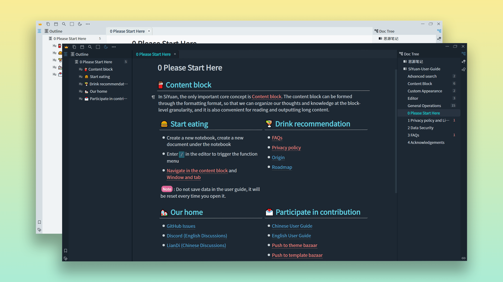
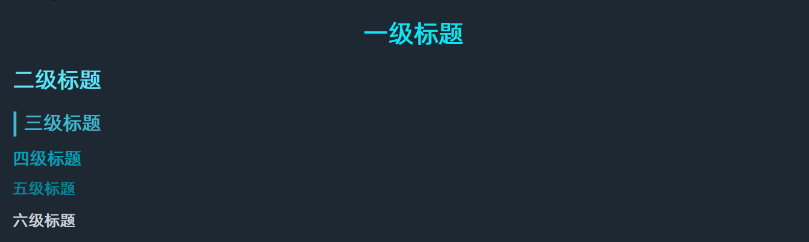
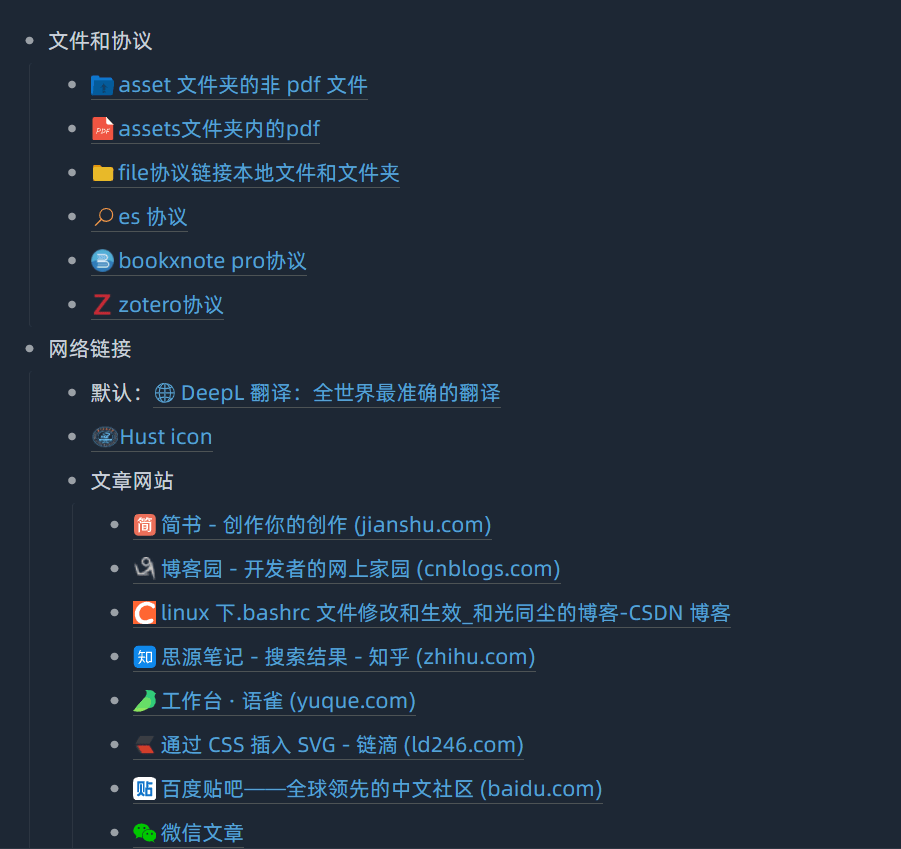
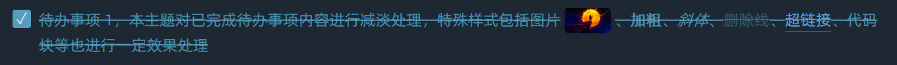
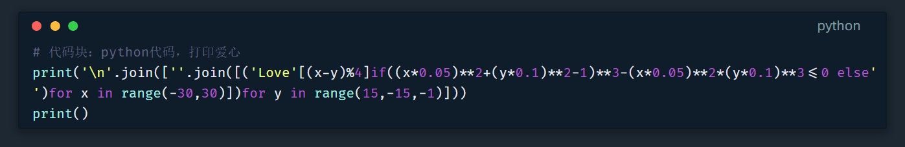
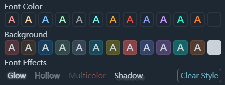
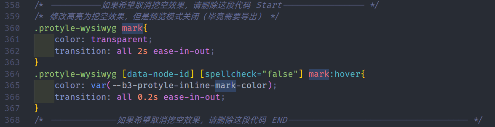
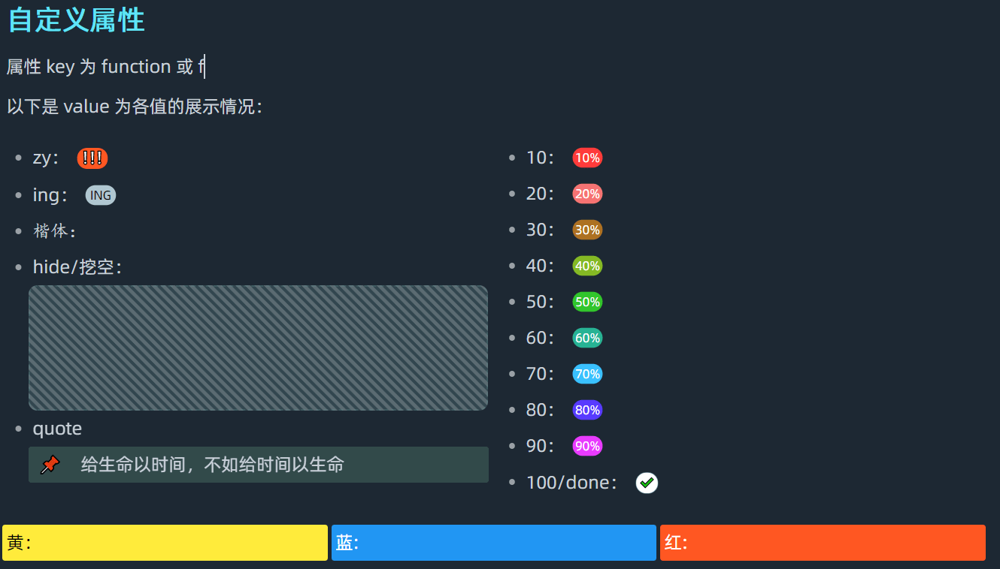
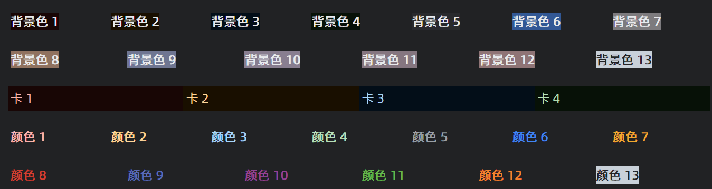
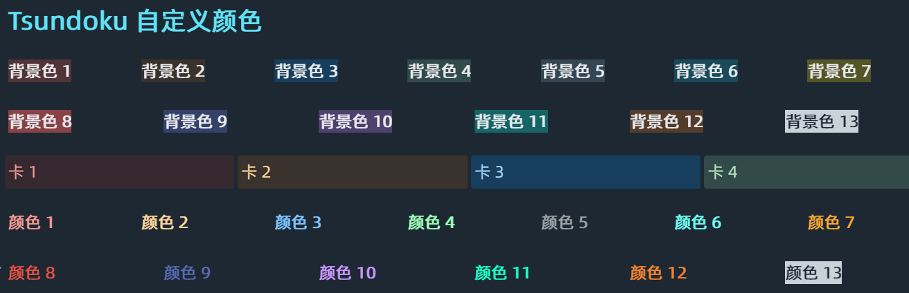

<h1 align="center">🌙Tsundoku(dark): A Theme for SiYuan Note</h1>

          
           
            
           <a href="https://github.com/Achuan-2/siyuan-themes-tsundoku/releases">
                      <https://img.shields.io/github/release/Achuan-2/siyuan-themes-tsundoku.svg" alt="Release">
           </a>
           
           
           
          

English |<a href="https://www.yuque.com/achuan-2/siyuan/fqew9h"> 中文介绍</a>

[SiYuan](https://github.com/siyuan-note/siyuan) is a local-first personal knowledge management system, supports fine-grained block-level reference, and Markdown WYSIWYG. This is a theme for it.  

> 🎠 This may not be the most aesthetically pleasing theme for you, but perhaps it will be one of the most sought-after themes for the ultimate experience！
> 
> Others Themes:🌞[Tsundoku Light](https://github.com/Achuan-2/siyuan-themes-tsundoku-light) | 🧇[Tsundoku Texture ](https://github.com/Achuan-2/siyuan-themes-tsundoku-texture) | 🥗[Tsundoku Green](https://github.com/Achuan-2/siyuan-themes-tsundoku-green)

## 💌 Origin

Tsundoku “積 ん 読” , a Japanese word，explained in Wikipedia as “Tsundoku is acquiring reading materials but letting them pile up in one's home without reading them. It is also used to refer to books ready for reading later when they are on a bookshelf.”

> Any PKM approach that doesn’t tie into execution tools is destined to languish on the back burner forever.

I use this name to wake myself up and hope that SiYuan will help me make gradual progress and  get things done better, instead of becoming another dustbin for relieving intellectual anxiety and satisfying my digital hoarding disorder.

## ✨Features

* **Optimized  style of each level title**

* **Added hyperlink icon**  to distinguish local protocol of different softwares from web links,to learn all supported links, see [more info](https://www.yuque.com/achuan-2/siyuan/gar358)  

* **Rich dynamic effects**：hovering over the button icon with a magnification effect, etc. to enhance the user experience when writing and reading.
* **Optimized style of completed Task list**：A lot of optimization has been done to the task list effect, when the task list is checked, the normal text will change color with strikethrough, and the style of each line and block in the completed task list has been handled in some way, for example, the opacity of the images and code blocks in the completed task list will be reduced.

* **Unified emoji style for Win and Android**：Modify the default emoji on Android to Win 10 emoji--Segoe UI Emoji to ensure the uniformity of emoji style.
* **MAC's code block style** 

* **Optimized  text color and background color popup**  

## 💥Impotant Changes

1. This theme temporarily set highlighting <kbd>Ctrl+E</kbd>, to a hide effect: the highlighted text is shown only when mouse hovering, and the default text is hidden.

   * If you need to cancel this effect, please search for the `.protyle-wysiwyg mark` keyword in the theme css, and delete the suggested code 
   
2. Added custom block attribute styles

   * Attributes key are set to `function` or `f` (abbreviated)
   * value can be

     * **zy/important**: add "❗❗❗" the end of this block;
     * **ing** : add "ing" the end of this block;
     * **done/100**: add "done" the end of this block;
     * **10/20/30.../90**: add 10%/20%/.../90% at the end of this block;
     * **kaiti**：The font-family of this block will be set to Kaiti;
     * **hide/挖空**：This block will be automatically hided;
     * **quote**: 📌quote style;
     * **yellow/黄**：This block will
     *  have a yellow background color;
     * **blue蓝**：This block will
     *  have a blue background color;
     * **red/红**：This block will
     *  have a  red background color;
   * How to use:  use <kbd>Shift+Click</kbd> to  click the block icon to open the attribute list, click <kbd>add</kbd >, enter the attribute name  `function` or `f`, and enter the corresponding attribute value (such as "hide")
   * preview image：
3.  Customized text color and background color

      dark theme：

      | Condition   | Color Scheme                                                                                        |
      | ------ | ----------------------------------------------------------------------------------------------- |
      | Before | |
      | After | |

## ☎️Feedback

If there is a problem with the style of the theme, welcome to raise an issue in this repo or contact me via email (achuan-2@outlook.com). Before raising an issue, it is recommended to switch to the default theme to make sure it is a problem specific to this theme.

## 🚀Change Log

See [CHANGE_LOGS](CHANGE_LOGS.md)