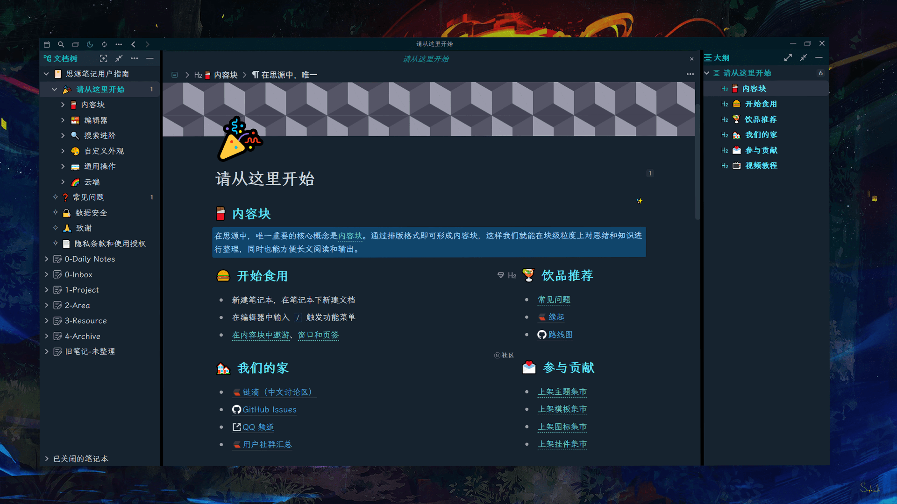

<h1 align="center">🌙Tsundoku(dark): A Theme for SiYuan Note</h1>

          
           
            
           
           <a href="https://github.com/Achuan-2/siyuan-themes-tsundoku/releases">
                      <https://img.shields.io/github/release/Achuan-2/siyuan-themes-tsundoku.svg" alt="Release">
           </a>
           
           
           
          

> 🎠 This may not be the most aesthetically pleasing theme for you, but perhaps it will be one of the most sought-after themes for the ultimate experience！
> 
> Others Themes:🌞[Tsundoku Light](https://github.com/Achuan-2/siyuan-themes-tsundoku-light) | 🧇[Tsundoku Texture ](https://github.com/Achuan-2/siyuan-themes-tsundoku-texture) | 🥗[Tsundoku Green](https://github.com/Achuan-2/siyuan-themes-tsundoku-green)

## 💌 Origin

Tsundoku “積 ん 読” , a Japanese word，explained in Wikipedia as “Tsundoku is acquiring reading materials but letting them pile up in one's home without reading them. It is also used to refer to books ready for reading later when they are on a bookshelf.”

> Any PKM approach that doesn’t tie into execution tools is destined to languish on the back burner forever

I use this name to wake myself up and hope that SiYuan will help me make gradual progress and  get things done better, instead of becoming another dustbin for relieving intellectual anxiety and satisfying my digital hoarding disorder.

## ✨Features

* **标题样式优化**: 
* **动效丰富**：块引用鼠标悬浮预览页面展开动效、悬浮在按钮图标上有放大效果等，提升用户在写作和阅读时的体验。
* **任务列表样式优化**：对任务列表效果做了很多的优化，当把任务列表勾选时，普通文字变色加删除线，并针对完成的任务列表中的各个行内和块样式都做了一定处理。完成的任务列表中的图片和代码块透明度降低
* **win端和安卓端emoji样式统一**：修改**安卓端的默认 emoji** 为 Win 10 emoji——Segoe UI Emoji，保证emoji样式统一
* **代码块样式调整**
* **文字颜色和背景色选框样式优化**  

## 💥Impotant Changes

1. 本主题暂时将高亮<kbd>Ctrl+E</kbd>,设置为挖空效果：悬浮时才显示高亮的文字，默认隐藏文字

   * 如果需要取消该效果，请在主题 css 中搜索「挖空」关键词，将所提示的代码删除
2. 添加了自定义块属性样式

   * 属性 key 都为 function或f（简写）
   * value 可为

     * **zy/important**：代表重要
     * **ing** ：代表进行中
     * **done/100** ：代表事项已完成
     * **10/20/30.../90**：代表完成 10/20/30.../90%
     * **kaiti**：字体为楷体
     * **hide/挖空**：挖空效果
     * **quote**: 📌引用
     * **yellow/黄**：黄色背景色
     * **blue蓝**：蓝色背景色
     * **red/红**：红色背景色
   * 使用方式：单击块标选择打开属性列表或<kbd>Shift+Click</kbd>打开，点击<kbd>添加</kbd>，输入属性名为function或f，并输入相应的属性值（如“hide”）
   * 预览图：
3. 对文字样式进行了自定义

   dark 主题：

   | 状态   | 配色情况                                                                                        |
   | ------ | ----------------------------------------------------------------------------------------------- |
   | 修改前 | |
   | 修改后 | |

## ☎️Feedback

若主题存在样式的问题，欢迎在此repo提issue或是通过邮箱联系我(achuan-2@outlook.com)。在提issue之前建议先切换为默认主题，确定是本主题特有的问题。

## 🚀Change Log

见[更新日志](CHANGE_LOGS.md)
